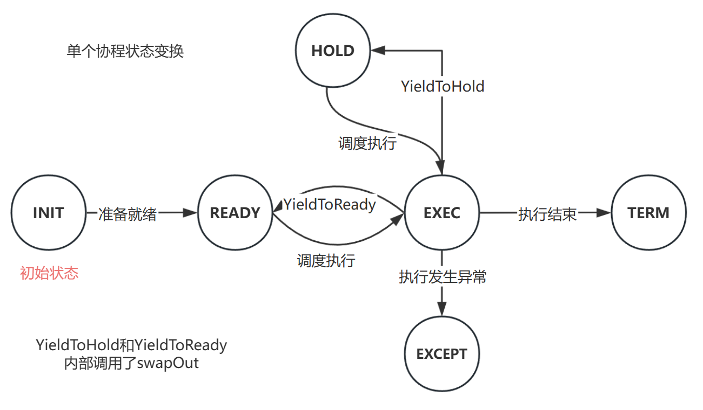
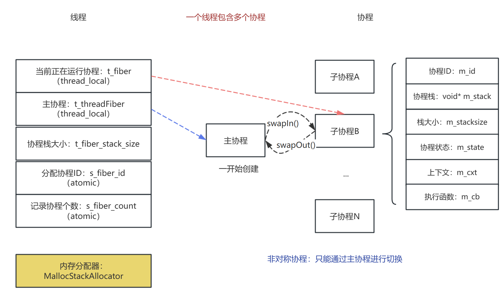
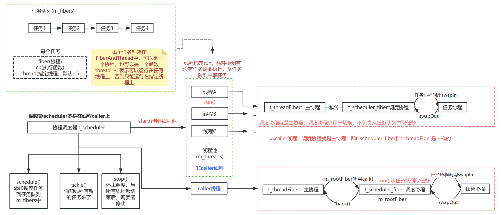

# sylar-zje
C++高性能服务器框架sylar-源码阅读，包含日志模块、配置模块、线程模块、协程模块、协程调度模块等，个人学习使用，学习过程中记录笔记更新至博客。
博客链接：https://blog.csdn.net/qq_44913173/category_12492198.html

## 进度日志
### 日志模块
**功能介绍**：输出日志，可定义日志输出地（使用观察者模式），如控制台、文件。可自定义日志格式，初始化时对日志格式进行解析，类似printf的功能，按照指定格式进行解析，如依次输出时间、线程ID、线程名称、协程ID、日志级别、日志名称、消息（涉及到线程协程相关的信息，目前是固定的值，非实际获取，做完相应模块后再完善）

面试被问到日志进程的日志如何发给其他进程，也就是如何实现进程间的通信。这里使用本地套接字，新建一个SocketLogAppender类作为日志输出地，两个进程通过本地套接字通信，日志服务器发送消息（模拟）给客户端，客户端接收消息并输出。这里应该还要写一个日志发送的经常（控制台输入日志，发送给客户端，需要利用共享内存来共享日志器，待完善）。

### 配置模块
**功能介绍**：目前支持定义、声明配置项，使用yaml-cpp作为YAML解析库，从配置文件中加载用户配置，支持基本数据类型、STL容器、自定义复杂数据类型与YAML字符串的相互转换（使用仿函数、偏特化实现），支持配置变更通知(监听器)，与日志系统进行整合。
```c++
// 从yaml中加载进来是YAML::Node形式
// 反序列化：从string加载到对象
fromString():
    string -> YAML::Node -> T
// 序列化：从对象转为string
toString():
    T -> YAML::Node -> string
```
**待完善**:
> 更新配置时应该调用校验方法进行校验，以保证用户不会给配置项设置一个非法的值。

> 应该需要有导出当前配置的功能（已完成日志系统配置导出到yaml文件）。

> 在多线程的情况下，线程不安全（已加入自旋锁保证线程安全）。

> 插入新的键值对时，只能通过Lookup查找键的方式，且必须传入value，如果找不到该键就将键值对插入，可以新写一个函数来实现该功能。

### 线程模块
基于pthread封装线程模块，学习自旋锁、互斥锁、读写锁、条件变量、信号量，使用条件变量、信号量实现生产者消费者问题。
线程模块与日志模块、配置模块整合。

### 协程模块
基于ucontext实现非对称协程(保存下上文信息，切换上下文信息)，每个线程包含一个主协程，协程之间切换必须通过主协程。具体将协程用到哪些地方，还需实践。



### 协程调度模块
之前的协程模块只能通过手动进行调度，协程调度模块中有一个任务队列，保存需要执行的任务，内部实现一个线程池，协程调度模块负责将任务分配给各个协程，实现协程在多个线程之间切换，提高执行效率，支持调度器所在caller线程参与调度，目前调度算法为先来先服务。


#### 遗留问题：

日志系统打印出的文件名，有的是从根路径开始，有的是相对路径，需要解决一下

